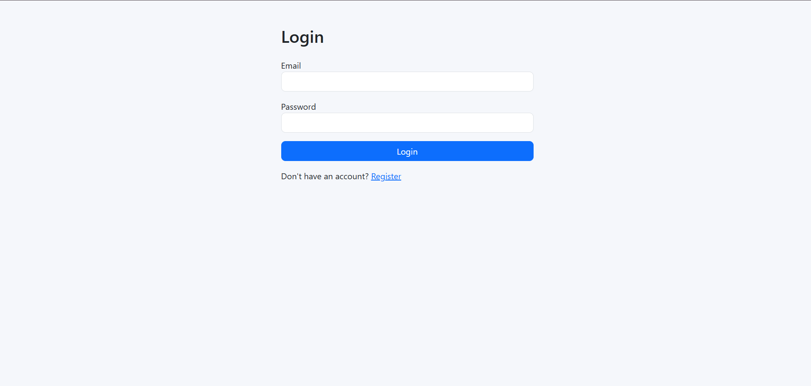
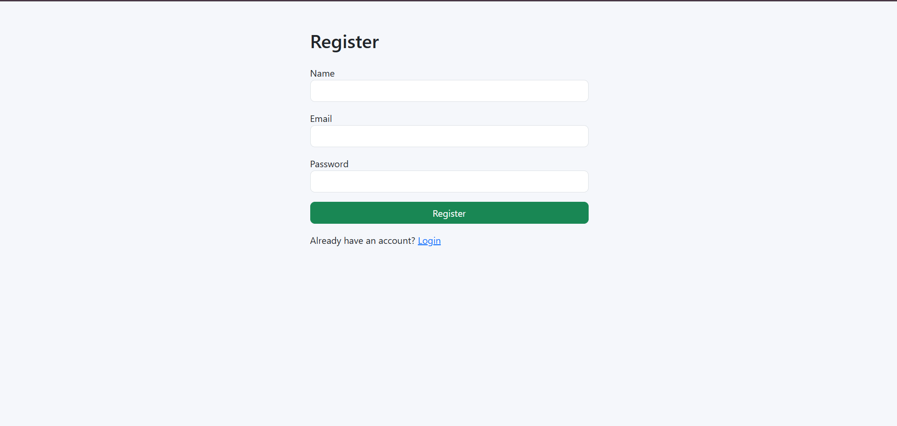
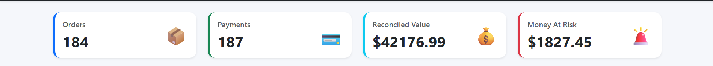
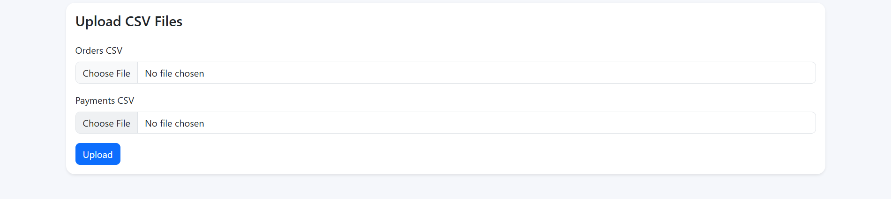
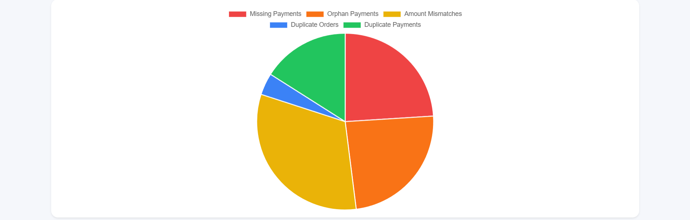
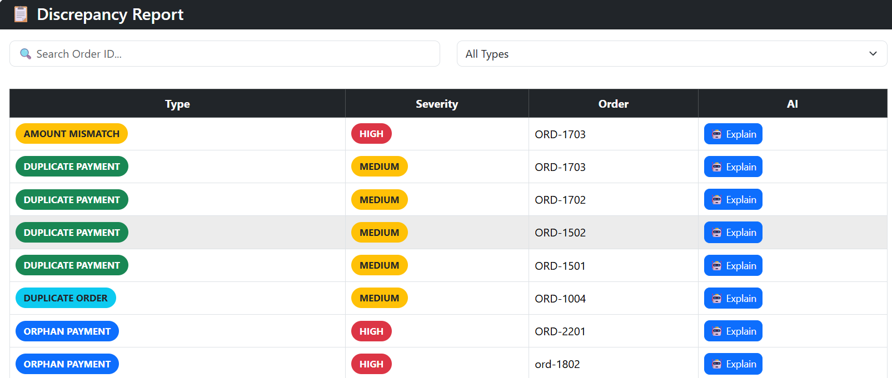
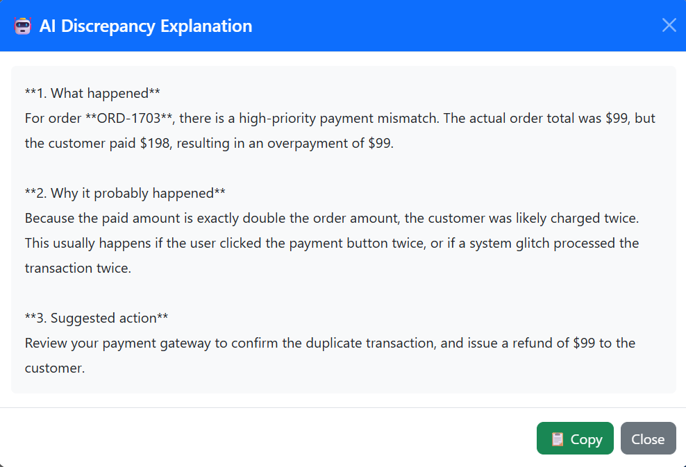

# 📊 ReconAI: AI-Powered Financial Reconciliation Dashboard


ReconAI is a full-stack AI-powered financial reconciliation platform
that compares Orders and Payments CSV files, detects discrepancies,
visualizes reconciliation metrics, and generates AI explanations using
Google Gemini.

## 🚀 Live Demo

**Frontend:**https://dashboard-one-gold-31.vercel.app/

**Backend:**https://financial-reconciliation-api.onrender.com

## ✨ Features

- JWT Authentication
- CSV Upload (Orders & Payments)
- Automated Financial Reconciliation
- Missing Payment Detection
- Orphan Payment Detection
- Amount Mismatch Detection
- Duplicate Orders & Duplicate Payments Detection
- Dashboard Summary Cards
- Interactive Pie Chart
- Search & Filter
- Google Gemini AI Explanations
- Responsive Bootstrap UI
- Cloud Deployment (Render + Vercel)

## 🛠 Tech Stack

### Frontend

- React.js
- Bootstrap 5
- Axios
- React Router DOM
- Chart.js

### Backend

- Node.js
- Express.js
- MongoDB Atlas
- Mongoose
- JWT Authentication
- Multer
- Joi Validation
- csv-parser

### AI

- Google Gemini API

### Deployment

- Render
- Vercel

## 🏗 Architecture

```text
React Frontend
      │
      ▼
Express REST API
      │
      ▼
MongoDB Atlas
      │
      ▼
Google Gemini API
```

## 📁 Folder Structure

```text
Dashboard
├── backend
│   ├── config
│   ├── controllers
│   ├── middleware
│   ├── models
│   ├── routes
│   ├── uploads
│   ├── utils
│   ├── validators
│   └── app.js
├── frontend
│   ├── src
│   │   ├── components
│   │   ├── context
│   │   ├── pages
│   │   ├── services
│   │   ├── styles
│   │   ├── App.jsx
│   │   └── main.jsx
│   └── package.json
├── screenshots
└── README.md
```

## ⚙️ Installation

### Backend

```bash
cd backend
npm install
npm run dev
```

### Frontend

```bash
cd frontend
npm install
npm run dev
```

Create a `.env` file inside the `backend` directory.:

```env
PORT=5000
MONGO_URI=
JWT_SECRET=
GEMINI_API_KEY=
```

## 📡 API Endpoints

### Authentication

```http
POST /api/auth/register
POST /api/auth/login
```

### Upload

```http
POST /api/upload
```

### Dashboard

```http
GET /api/dashboard
```

### AI

```http
GET /api/ai/:id/explain
```

## 🤖 AI Integration

Users can click the **Explain** button beside any discrepancy. The
backend sends the discrepancy details to Google Gemini, which returns:

1.  What happened
2.  Why it probably happened
3.  Suggested action

## 📸 Screenshots

### Login



---

### Register



---

### Dashboard Summary



---

### Upload CSV



---

### Analytics



---

### Discrepancy Report



---

### AI Explanation



## 🚀 Deployment

- Frontend: Vercel
- Backend: Render
- Database: MongoDB Atlas
- AI: Google Gemini API

## 📈 Future Improvements

- Real-time payment gateway webhooks
- PDF & Excel export
- Email notifications
- Admin dashboard
- Analytics & trends

## 👨‍💻 Author

**Deva Charya**

- GitHub: https://github.com/devacharya80
- LinkedIn: https://www.linkedin.com/in/deva-charya/

---

⭐ If you like this project, consider giving it a star on GitHub.
